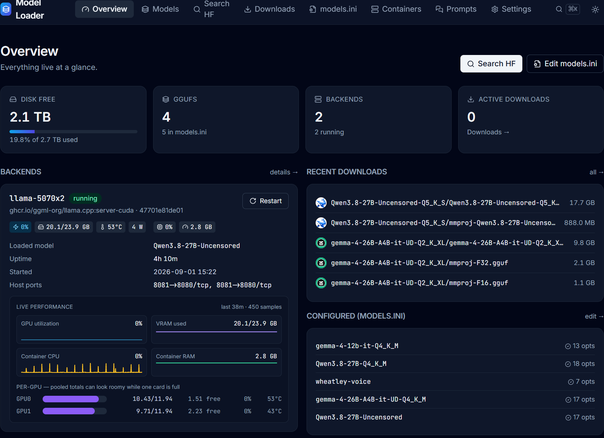

# Model Loader

A browser UI for managing llama.cpp GGUF models and containers on a personal homelab box. FastAPI + HTMX + Alpine + Tailwind, no build step, one Docker container.



## What it does

- **Search + download GGUFs from Hugging Face** — parallel-range downloader (8 chunks by default), live per-chunk speed sparklines, resume-on-restart, HF token stored locally for gated repos.
- **Manage `models.ini`** (the llama-server `--models-preset` file) with a 98-field form organized into 10 tiers (Core → Reasoning → Sampling → Server → …). Tooltips on every field. Atomic writes with 10 rolling backups.
- **Autoconfig** — reads a GGUF's metadata + probes your live GPU VRAM, then picks `ctx-size`, `n-gpu-layers`, RoPE extension, cache quant, MoE offload params, and reasoning-effort flags that actually fit. Handles single-GPU, multi-GPU (`-sm layer`), hybrid attention+SSM (Qwen 3.5/3.6), sliding-window attention (Gemma), and MoE (GPT-OSS, Qwen3-Coder).
- **Per-backend hardware dashboard** — GPU util, VRAM used/total, temperature, power draw; container CPU% and RSS; log tail with grep filter; one-click restart.
- **Auto-discovers llama containers** on your Docker socket (any `ghcr.io/ggml-org/llama.cpp:*` image). Add a new backend to your compose file, run `docker compose up -d`, it appears in the UI within 2 seconds.
- **OpenWebUI integration** — detects backends OpenWebUI doesn't know about (or points at containers that no longer exist), and one-click reconciles by writing directly to OpenWebUI's `webui.db` (which is what its PersistentConfig actually reads). Also:
  - **Per-connection and per-model visibility** — pick which models each backend offers, so a CPU backend only serves the small ones it can actually run.
  - **Dead-id detection** — OpenWebUI *renders* its model whitelist rather than intersecting it with what the backend reports, so a deleted or renamed model keeps appearing in the picker and fails with "model not found" only when someone selects it. Model Loader flags those and removes them in one click.
  - **Vision capability sync** — a model can accept images only if its section declares an `mmproj`, but OpenWebUI's default is permissive and it offers the image-upload control on everything. Model Loader derives the flag from the projector's own metadata (`clip.vision.*` vs `clip.audio.*`, since llama.cpp uses the same `--mmproj` slot for audio encoders) and writes it per model.
- **Prompt library** — saved system prompts with copy-to-clipboard, stored in the app's sqlite.
- **Command palette** (Cmd/Ctrl-K) — jump to any page or model.

## Security posture

**This is a personal, LAN-only tool. There is no authentication.** It mounts `/var/run/docker.sock`, which is root-equivalent on the host — anyone who can reach the port can `docker exec` into any container. Do not expose port 8090 to the internet. Do not run this on a shared machine. If you need multi-user, add a reverse-proxy with auth in front, and understand that authenticated users still get docker-socket-level power.

## Requirements

**Model Loader manages an existing llama.cpp setup — it does not install or replace one.** If you have no llama.cpp container running, there is nothing for it to discover and the dashboard will be empty. Set that up first.

- **Linux host** (tested on Ubuntu/Debian, should work anywhere Docker runs)
- **Docker Engine + Compose plugin (v2)**
- **At least one running llama.cpp server container**, see below
- **A shared models directory** bind-mounted into both llama.cpp and Model Loader
- **NVIDIA GPU** with `nvidia-container-toolkit`, **AMD** with ROCm passthrough, or **CPU-only** — all work; vendor is auto-detected per container

### The llama.cpp container

Model Loader auto-discovers any container whose image matches `ghcr.io/ggml-org/llama.cpp:*`. For anything else — a self-built image, a fork — list it explicitly with the `LLAMA_CONTAINERS` env var.

Two things have to line up or Model Loader can see the container but not steer it:

1. **llama-server must be started with `--models-preset`**, pointing at the `models.ini` that Model Loader edits. Without it, llama-server never reads the file and your saved settings do nothing.
2. **The models directory must be mounted at the same path in both containers.** Model Loader writes `model = /models/...` paths into the ini; llama-server has to resolve them identically.

A minimal, working service:

```yaml
  llama:
    image: ghcr.io/ggml-org/llama.cpp:server-cuda
    container_name: llama
    restart: unless-stopped
    ports:
      - "8081:8080"
    volumes:
      - ./models:/models          # same path Model Loader uses
    command: >
      --models-preset /models/models.ini
      --host 0.0.0.0 --port 8080
      --models-max 1
    deploy:
      resources:
        reservations:
          devices:
            - driver: nvidia
              count: all
              capabilities: [gpu]
```

> **Keep model settings out of `command:`.** Anything you pass on the command line **overrides** the preset file, silently. A stray `--ctx-size` or `-np` in your compose beats whatever Model Loader writes into `models.ini`, and the symptom is a setting that appears saved but has no effect. Restrict `command:` to `--models-preset`, `--host`, `--port` and `--models-max`; everything per-model belongs in the ini.

`--models-max 1` keeps one model resident at a time, which is usually what you want on a single box — llama-server swaps on demand. Raise it if you have VRAM to hold several.

If you don't have a compose file yet, the **Containers** page has ready-made service blocks for CUDA, ROCm and CPU that you can copy after installing.

## Install

The fastest path — `bootstrap.sh` adds the `model-loader` service to your existing compose file and brings it up.

```bash
git clone https://github.com/scratchhax/model-loader.git ~/ai-lab/model_loader
cd ~/ai-lab              # your compose project directory
bash ~/ai-lab/model_loader/bootstrap.sh
```

Then open `http://<host>:8090`.

**If you have existing GGUFs in a flat layout** (`/models/*.gguf`), run the one-shot migration to move them into per-model subdirectories:

```bash
docker exec model-loader python3 -m app.migrate_layout
```

This is safe to re-run; it skips anything already migrated. It also updates absolute paths in `models.ini` for you.

### Manual install (if you don't want bootstrap.sh touching your compose)

Paste this block into your `docker-compose.yaml`:

```yaml
  model-loader:
    build: ./model_loader
    container_name: model-loader
    restart: unless-stopped
    ports:
      - "8090:8090"
    environment:
      - MODELS_DIR=/models
      - MODELS_INI_PATH=/models/models.ini
      - DATA_DIR=/data
    volumes:
      - ./models:/models
      - ./model_loader_data:/data
      - /var/run/docker.sock:/var/run/docker.sock
```

Then `docker compose up -d --build model-loader`.

## First-run walkthrough

1. **Dashboard** (`/`) — you should see your llama.cpp containers listed under Backends with live GPU stats. If not, the container isn't running or its image isn't a `ghcr.io/ggml-org/llama.cpp:*` tag; use `LLAMA_CONTAINERS` env to force a whitelist.
2. **Settings** (`/settings`) — paste a Hugging Face token here if you want to download gated models. Stored in the app's sqlite at `/data/model_loader.db`.
3. **Search** (`/search`) — search HuggingFace, expand any repo, click Download on the GGUF file(s) you want. If the repo has a matching `*mmproj*.gguf` (vision projector), it's auto-queued into the same subdirectory.
4. **Downloads** (`/downloads`) — live progress with per-chunk speed sparklines. Cancel, retry, or clear finished.
5. **Models** (`/models`) — everything you've downloaded. Click a model to open its detail page (metadata, quant, size, chat template, README).
6. **Config** (`/config`) — one section per model in `models.ini`. For a new model, click **Autoconfig**; it fills in every field based on live hardware probe + GGUF metadata. Review, tweak if you want, hit Save.
7. **Containers** (`/containers`) — restart, view logs (with grep filter), see OpenWebUI drift and one-click reconcile.

## Configuration (environment variables)

All optional. Defaults in `app/config.py`.

| Var | Default | Purpose |
|---|---|---|
| `MODELS_DIR` | `/models` | Where GGUFs live (inside the container). Bind-mount your host models dir here. |
| `MODELS_INI_PATH` | `/models/models.ini` | Path to the llama-server preset file. |
| `DATA_DIR` | `/data` | Sqlite state — HF token, prompts, avatar cache, download history. |
| `LLAMA_CONTAINERS` | *(empty)* | Comma-separated whitelist. Empty = auto-discover any `ghcr.io/ggml-org/llama.cpp:*` container. |
| `GPU_VRAM` | *(empty)* | Per-container VRAM overrides, e.g. `llama-7900xt:20,llama-5070:12`. Auto-probes via `nvidia-smi` / `rocm-smi` if unset. Useful when the reported total is wrong (some AMD stacks under-report). |
| `MAX_CONCURRENT_DOWNLOADS` | `2` | Parallel download job cap. |
| `BIND_PORT` | `8090` | HTTP port. |

## Multi-GPU

If a llama container sees two or more GPUs (via `count: all` or `device_ids`), Model Loader:

- Aggregates their stats on the dashboard (VRAM sum, util avg, temp max, power sum, name shown as `2 × NVIDIA GeForce RTX 5070`).
- Uses the pooled VRAM in Autoconfig with a small (~8%) overhead multiplier for cross-GPU handoffs, **and then re-checks every candidate against each card individually**. Pooled capacity is necessary but not sufficient: llama.cpp places each layer on one specific card, so a config can fit the pool comfortably and still OOM a single device.
- Emits `-sm layer` so llama-server distributes layers across cards.
- **Computes an explicit `tensor-split` when expert offload is in play.** `split-mode = layer` divides layers by *count*, which is right for a dense model where every layer costs the same and badly wrong for a MoE under `--n-cpu-moe N`: layers below N keep only attention on the GPU while the rest carry full experts, so the per-layer cost jumps by an order of magnitude partway through and an even split hands one card nearly all the expensive layers. Autoconfig balances by bytes instead, weighting by each card's capacity (so a 24 GB card beside a 12 GB one gets proportionally more, not equally much) and charging the projector and compute buffer to the main GPU, since those are not layer-split.

See `docs/AUTOCONFIG.md` for the math and the empirical calibration.

## Backups

Model Loader's own state is two files, both small:

1. **`./model_loader_data/model_loader.db`** — HF token, saved prompts, download history, avatar cache.
2. **`./models/models.ini`** — the llama-server preset file. Model Loader already keeps 10 rolling copies beside it as `models.ini.bak-*` on every write.

Back those up however you back up anything else. Two things worth knowing if you roll your own:

- **Copy the sqlite file with the online backup API, not `cp`.** A plain copy of a live database can capture a torn page, and copying `foo.db` without its `foo.db-wal` silently loses every transaction still in the log. `python3 -c "import sqlite3,sys; s=sqlite3.connect(sys.argv[1]); d=sqlite3.connect(sys.argv[2]); s.backup(d)" src.db dest.db` does it correctly, with no need to stop the container.
- **The GGUFs are excluded on purpose.** They are large and re-downloadable; back them up with rsync/borg/restic if you want, but they are not state.

Restoring is just putting those two files back and running `docker compose restart model-loader`.

## Documentation

- [`docs/AUTOCONFIG.md`](docs/AUTOCONFIG.md) — how Autoconfig picks values: KV cache math, VRAM budget model, MoE offload strategy, RoPE extension policy, calibration data.
- [`docs/TROUBLESHOOTING.md`](docs/TROUBLESHOOTING.md) — OOMs, "container not found", OpenWebUI drift, download stalls, dashboard blank.
- [`docs/ARCHITECTURE.md`](docs/ARCHITECTURE.md) — file layout, data flow, why each design choice.

## Architecture at a glance

```
Browser (HTMX + Alpine + Tailwind CDN)
   │
   ▼
FastAPI (app/main.py) ──── Jinja2 templates (app/templates/)
   │
   ├── app/services.py    docker SDK, models-dir helpers, OpenWebUI reconciler
   ├── app/autoconfig.py  KV cache math, preset picker, VRAM fit
   ├── app/hw.py          background sampler (nvidia-smi / rocm-smi via docker exec)
   ├── app/hf.py          HF Hub API (search, repo tree, avatar cache)
   ├── app/gguf_meta.py   hand-rolled GGUF v3 metadata reader
   ├── app/downloader.py  parallel-range download engine + sqlite job history
   ├── app/ini.py         models.ini schema + parser + atomic writes
   ├── app/db.py          sqlite prefs
   └── app/migrate_layout.py  one-shot flat → per-model-subdir migration
```

No frontend build step. No JS bundler. Everything ships from CDN or Jinja. Total footprint: ~1200 lines of Python, ~15 templates.

## License

Personal use. No warranty. Don't expose to the public internet.
