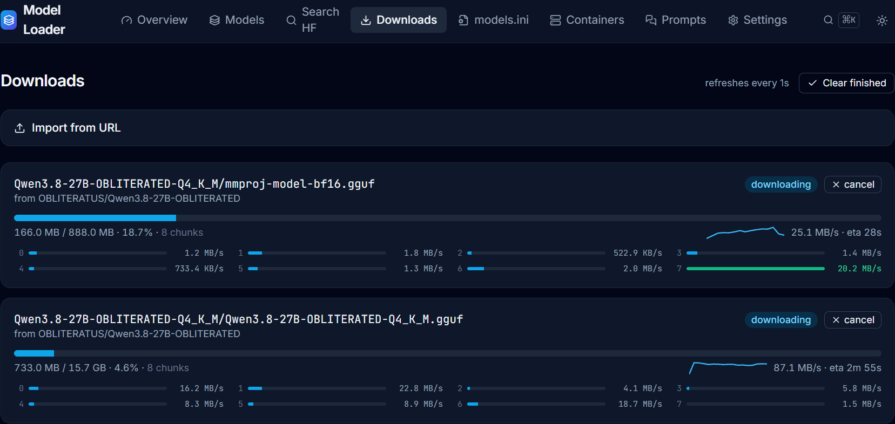
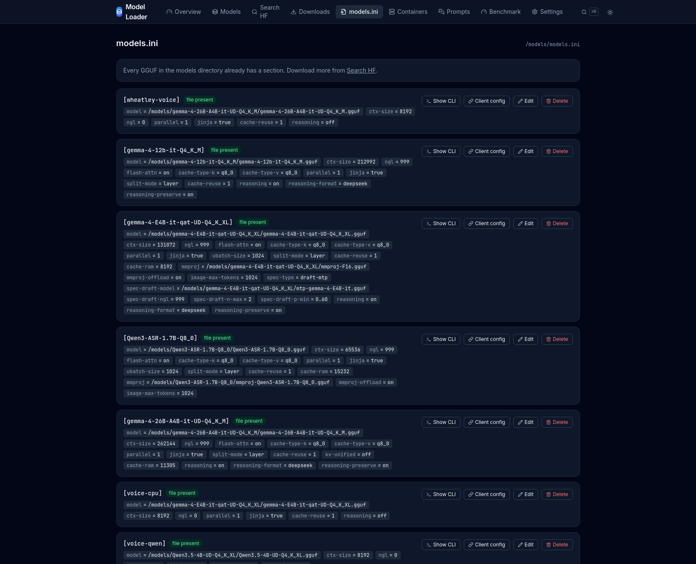
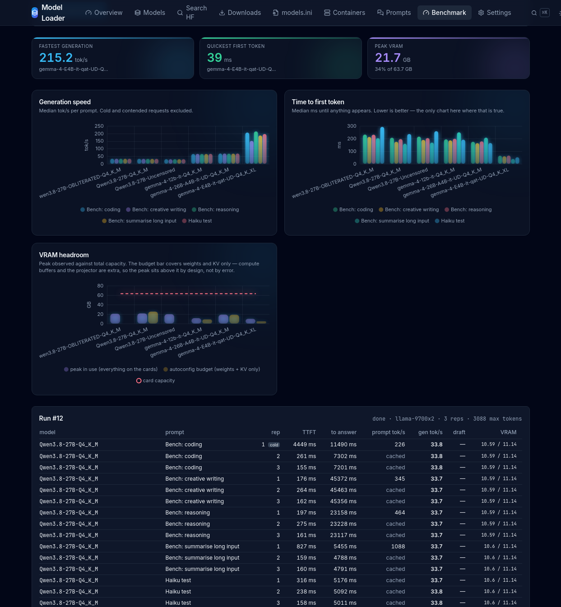
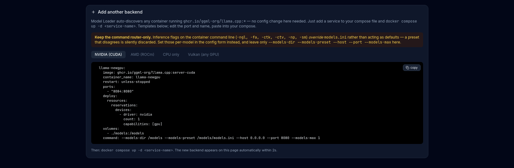

# Model Loader

A browser UI for managing llama.cpp GGUF models and containers on a personal homelab box. FastAPI + HTMX + Alpine + Tailwind, no build step, one Docker container.

![The Model Loader overview page: estimated power at the wall and the hottest device in the box, each with a sparkline drawn against a configured ceiling; then the model being served — here Strata's qwen3.8-flash-next-unsloth-ud-iq4_xs, marked GENERATING — with four readouts: tokens/sec out with its own sparkline, tokens/sec in, how much of the 256k context window is in use, and this engine's expert cache hit rate at 99.8%, plus the host RAM line naming the expert arena Strata pins; then one panel per GPU breaking VRAM down against utilisation, temperature, power and fan speed; then "on the cards", listing every process holding a card with its compute occupancy and per-card VRAM, an Engine row for handing the GPUs between llama.cpp and a second engine, and eject/restore chips for GPU tenants that are not backends; then backend and storage summaries](docs/model_loader.png)

## What it does

- **Search + download GGUFs from Hugging Face** — parallel-range downloader (8 chunks by default), live per-chunk speed sparklines, resume-on-restart, HF token stored locally for gated repos.
- **Manage `models.ini`** (the llama-server `--models-preset` file) with a 98-field form organized into 10 tiers (Core → Reasoning → Sampling → Server → …). Tooltips on every field. Atomic writes with 10 rolling backups.
- **Autoconfig** — reads a GGUF's metadata + probes your live GPU VRAM, then picks `ctx-size`, `n-gpu-layers`, RoPE extension, cache quant, the prompt-cache budget and reasoning-effort flags that actually fit. Handles single-GPU, multi-GPU (`-sm layer`), hybrid attention+SSM (Qwen 3.5/3.6), sliding-window attention (Gemma), and MoE (GPT-OSS, Qwen3-Coder). For MoE models that overflow VRAM it stops guessing and hands placement to llama.cpp's own `--fit`, which is both safer and measurably faster than the split we used to compute. For a model that ships a vision projector, **vision is a switch**: turn it off and autoconfig stops reserving the projector's VRAM and shows you the context that buys.
- **Per-slot detail when a model runs `parallel > 1`** — the headline tokens/sec is the machine's, summed over the slots that are generating, and a strip underneath gives each slot its own rate and context. They diverge more than you would expect: two slots decoding 400 tokens each in the same batch held 38.5 and 27.4 tok/s for seven seconds, because speculative decoding gets the draft head accepted far more often on code than on prose. The strip's rows shrink and wrap as the slot count grows, so eight slots still fit beside the sparkline.
- **Where the VRAM actually went** — every panel that shows VRAM splits it into model weights, context (KV), overhead and compute buffers rather than one number. The compute buffer is the reason: it scales with context rather than with the model, and on a 27B at a 786K pool it is 14.9 GB against 15.6 GB of weights, which is not something to discover by running out. When a model is bigger than the cards, a second bar shows how much of it is in host RAM — **measured, not predicted**. llama.cpp does not report that at any verbosity; it is read from what the driver says the running process holds.
- **Benchmarking** — a fixed prompt suite run through the live server (first-token latency, draft acceptance, VRAM), and throughput sweeps driven by llama.cpp's own `llama bench`. Charts and stat panels; every response's text is kept so a run can be read, not just measured. Nothing is written back to any config.
- **Capability badges** — rate a model yourself, out of five, per category (coding, creative writing, reasoning, tool use, vision), from the benchmark run where you just read its output. The models list shows what each model is good at, or says `not rated`.
- **Measured throughput, not just predicted** — llama-server already reports prompt speed, generation speed and speculative acceptance for every request it serves. Model Loader reads those back out of the container logs and shows the median in the Autoconfig panel, alongside a comparison of every configuration that model has actually run under.
- **Live overview** — power at the wall and the hottest device in the box, each with a sparkline drawn against a ceiling you set; then the loaded model with tokens/sec in and out, how much of its context window is in use and how much of that came from cache; then per-card GPU telemetry. Power and temperature thresholds are editable from the page.
- **Per-backend hardware dashboard** — GPU util, VRAM used/total, temperature, power draw, fan duty and RPM; container CPU% and RSS; log tail with grep filter; one-click restart.
- **Inline load-failure diagnosis** — when a model's load actually fails, the dashboard and backend card say which model and its exit code, and a **Diagnose** button reads that model's own log lines and maps the failure to a concrete fix (VRAM OOM → lower `ngl`/`ctx` or enable `--fit`; KV-cache overflow → quantize it; missing `model =` or `mmproj =` file; corrupt/incomplete GGUF; ctx past the trained length; port in use). An idle router with nothing loaded is normal and never raises it, a model that loads successfully afterwards clears it, and only the container's current run is read, so errors from before a restart don't linger. It only ever proposes what to check, and says so plainly when the cause isn't one it can name.

- **Auto-discovers llama containers** on your Docker socket (any `ghcr.io/ggml-org/llama.cpp:*` image). Add a new backend to your compose file, run `docker compose up -d`, it appears in the UI within 2 seconds.
- **OpenWebUI integration** — detects backends OpenWebUI doesn't know about (or points at containers that no longer exist), and one-click reconciles by writing directly to OpenWebUI's `webui.db` (which is what its PersistentConfig actually reads). Also:
  - **Per-connection and per-model visibility** — pick which models each backend offers, so a CPU backend only serves the small ones it can actually run.
  - **Dead-id detection** — OpenWebUI *renders* its model whitelist rather than intersecting it with what the backend reports, so a deleted or renamed model keeps appearing in the picker and fails with "model not found" only when someone selects it. Model Loader flags those and removes them in one click.
  - **Vision capability sync** — a model can accept images only if its section declares an `mmproj`, but OpenWebUI's default is permissive and it offers the image-upload control on everything. Model Loader derives the flag from the projector's own metadata (`clip.vision.*` vs `clip.audio.*`, since llama.cpp uses the same `--mmproj` slot for audio encoders) and writes it per model.
- **Prompt library** — saved system prompts with copy-to-clipboard, stored in the app's sqlite.
- **Command palette** (Cmd/Ctrl-K) — jump to any page or model.

### Downloading



Each file is fetched as eight concurrent byte-range requests, so a single slow chunk doesn't gate the whole transfer — the per-chunk readouts make that visible, and they are rarely even. Jobs survive a restart of Model Loader and resume from the last completed chunk rather than starting over.

The two jobs above are one action: downloading a multimodal model auto-queues the matching `mmproj` projector from the same repo into the same directory, because the model is not much use without it.

### Autoconfig, in practice

![The Autoconfig panel: measured generation and prompt speed from real requests with a table comparing the configurations actually run, then a concurrent-sessions picker, a vision toggle, four priority presets (Fast, Balanced, Long context, Custom) each showing context size and KV cost, a part-to-whole meter splitting the recommended configuration's VRAM into model weights, context, overhead and compute buffers with a second bar showing how much of the model would sit in host RAM, and a per-backend table marking which context sizes fit and which do not](docs/model_performance_selector.png)

Pick how many chats will hit the model at once, then pick a priority. Each preset shows what you are trading: context size against GPU layers against speed. The table underneath marks every context size as fitting or not on each backend, and names the cost when it doesn't — `9L on CPU` means nine layers had to move off the GPU to make that context fit.

For a model with a projector beside it there is also a **Vision** switch, showing the context each state buys. The projector and its encoder buffer can't be split across cards, so they sit whole on the main GPU. On a 27B here, vision on allows 64K with every layer on the GPUs; vision off allows 152K. Off is saved as `mmproj-auto = off`, so the next autoconfig run doesn't quietly switch it back on.

The speed figures are an **ordering hint, not a benchmark**. They come from a calibrated penalty per CPU-resident layer; they will tell you Fast beats Long context, and they will not tell you your tokens per second. The panel says so too — and where real requests have been served, it shows the measured median beside the estimate.

Underneath the presets, **Where the VRAM goes** draws the recommended configuration as a part-to-whole meter of the whole card: model weights, context, overhead, compute buffers, free. Every number in it is the one the fit maths used, not a re-derivation. If the model is larger than the cards a second bar appears with its own denominator — the model, not the card — showing the split between what lands on the GPU and what streams from host RAM. For a MoE that is the experts; attention stays resident, which is why the share is measured in bytes and not in layers.

The same meter is drawn live on the overview, per card, from what is actually loaded. There the spill is measured rather than estimated: the fixed costs are allocated at load and do not move, so whatever else the device holds is weights, and the driver reports that per process.

### The models.ini editor



One card per section, with every option you have set shown as a chip, so the whole file is readable at a glance rather than by scrolling a text editor. **Copy CLI** renders the section as the equivalent `llama-server` command line, which is useful for reproducing a config outside Model Loader or pasting into a bug report.

**Client config** renders the section as ready-to-paste snippets for an API client — a `curl`, an OpenAI Python client, `OPENAI_BASE_URL`/`OPENAI_API_KEY` env vars, and a raw request JSON — wired to the model id (the section name) and the backend's LAN-reachable address, so they work from any machine rather than only from inside the compose network. A `Bearer` header is included only when the backend actually runs llama-server with `--api-key`.


`file present` confirms the section resolves to a GGUF on disk. That check follows the section's `model =` path rather than matching its name against a filename, so renaming a section to give a model a short API id does not break the link.

### Benchmarking



Two engines, because they answer different questions and neither can answer the other's.

The **prompt suite** sends real prompts through the running server and records what happened: time to first token, time until the answer proper begins (on a thinking model those are far apart), generation speed, speculative draft acceptance, and peak VRAM per card. It measures the configuration you actually run.

The **throughput sweep** shells out to llama.cpp's own `llama bench`, which warms up, repeats, reports a standard deviation and measures the model directly rather than the HTTP path. It starts from a `models.ini` section and carries that section's real settings across, rather than measuring llama-bench defaults nobody runs.

The gap between them is the point. On a model running `draft-mtp`, `llama bench` reports 133 tok/s and the server delivers 208 — llama-bench has no speculative decoding, no projector and no server slots, so it cannot see them. Both tables say so rather than letting the two numbers be compared naively.

A run is disruptive: the router holds one model at a time, so benchmarking several means evicting and reloading each in turn while everything else on the box stalls. The confirmation dialog states the cost in terms of your actual selection, a banner appears on every page for the duration (the job outlives the tab that started it), and stopping is safe — results already collected are kept. **Nothing is ever written to `models.ini`.**

Results are raw, one row per request, with cold and contended requests flagged rather than averaged in. Each row also keeps **the text the model actually produced**, collapsed underneath it — the table is about speed, but a run whose output you cannot read is one you have to take on trust.

There is still no "apply these findings" button and nothing is scored automatically. What you do with a run is read it, and optionally rate the model on the strength of it.

### Rating what a model is good at

Speed is measurable. "Is this any good at prose" is not, so Model Loader does not pretend to measure it.

Every model in a benchmark run gets a rating control beside its results: a category — coding, creative writing, reasoning, tool use, vision — and a score out of five, with an optional note. It lives on the run detail because that is where the model's output is on screen. Rating it from anywhere else would be rating a memory. The run id is stored alongside, so a badge traces back to the evidence that produced it rather than being an opinion from nowhere.

The models list shows the result in its **good at** column, or **not rated** — spelled out rather than left blank, because a cell that vanishes when empty makes "never judged" and "judged and poor" look identical. The editor is in the row's drawer, so an opinion formed a week after the benchmark still has somewhere to go.

This is deliberately manual, and an automated version was built as far as the schema before being deleted. The public coding benchmarks (HumanEval, MBPP) sit in nearly every model's training data, so their scores compress into a band that barely separates one local model from another; creative writing has no execution oracle at all, so an automated score there is one LLM judging another — circular when the judge is weaker than the subject, biased when it is the same family. Four responses read by the person who has to live with the answer is better evidence, and it costs no GPU time.

### Routing models to backends

![The Models directory grouped by family: headings like gemma-4-26B-A4B-it and gemma-4-E4B-it-qat, each with a model count and total size, and one line per served model carrying its MoE or dense shape, quant, placement, modality icons, state and your "good at" ratings. Under each file sits any models.ini section that serves it under another name - wheatley-voice, voice-cpu - marked "same file" instead of a size. The voice-cpu row is expanded to show its drawer: the per-backend "offered on" toggles, its own rating editor, the path on disk, a link to edit the section, and a note that it shares its weights with gemma-4-E4B-it-qat-UD-Q4_K_XL](docs/models_available.png)

Every llama.cpp backend reads the same `models.ini`, which means by default every backend offers every model — including the CPU one being asked for a 27B. The **offered on** toggles fix that per model: expand a row and click a backend to include or exclude it, and Model Loader writes the change into OpenWebUI's per-connection whitelist.

Companion files fold into the model they belong to rather than listing as models of their own: `mmproj` projectors, and also MTP and draft heads, which are not independently servable. An explicit `noMTP` variant is left alone, since that is a real model choice rather than a companion.

### Knowing when a model has actually changed

**Check for updates** asks Hugging Face what it holds for every file you downloaded, and compares **byte counts**, not dates. A repo's commit date moves whenever anything in it is touched — a README, a config, a new quant in a sibling directory — so "the remote commit is newer than my file" is true of nearly every model nearly always and says nothing about the weights. A GGUF whose length differs has been rebuilt, and that is not ambiguous. Only when Hugging Face will not report a size does this fall back to the date, and the tooltip says which test produced the answer so you know what it is worth.

The verdict covers a model's projector and draft head as well as its own shards, because those fold into its row and would otherwise have nowhere to be reported. When something is stale the chip is a **button**: it queues a fresh copy of every affected file from the repo it came from. Downloads land in a temp file and are moved into place when complete, so a model that is loaded right now keeps serving until it is reloaded.

The row also shows what each model actually is: MoE or dense, its quant, whether the weights fit one GPU, what it takes as input, and whether it is resident right now. Those chips are derived from the section's own config — GGUF header, its `mmproj`, its speculation profile — rather than from OpenWebUI's copy of it, so they are right for a section OpenWebUI has never been told about, and the **fix** button still flags the two disagreeing.

### Meta-models get their own row

A file and a model are not the same thing. `gemma-4-E4B-it-qat-UD-Q4_K_XL.gguf` backs two `models.ini` sections — its own and `voice-cpu` — with different settings over the same weights, and `voice-qwen` is the only name `Qwen3.5-4B` is served under at all. These are what you actually call from OpenWebUI, so each one is a row.

What belongs to the **file** appears once, on the row that owns it: the byte count, the select box, delete. A second section over the same weights says `same file` instead of a size, because removing it frees nothing and must not double the group totals — though it still sorts on the file's size, so the two stay together in a size sort rather than the alias sinking to the bottom. What belongs to the **section** is per row, and is the reason the split is worth making: whether it is loaded right now, whether speculation is configured for it, which backends offer it, and what you have rated it all differ between two sections over one file. Family and size tier come from the file either way, so an alias groups with the weights it runs rather than off under its own initial.

Every configured row carries a link straight to its section in `models.ini` — the settings that define it — and the **meta-model** filter chip lists them all.

### Finding one model among forty

A models directory grows monotonically and a flat alphabetical list stops being an organisation somewhere around a dozen files. The toolbar above the table groups, sorts, filters and searches, all client-side, and remembers what you chose:

- **Group by family** collapses the same model at several quants under one heading — `Qwen3.8-27B` holding its `UD-Q4_K_M` and `UD-Q8_K_XL` — with a file count and total size per heading, which is what you want open when you are deciding which copy to delete. The family is the filename with its quant suffix stripped, and variants then fold onto their base when the base is itself on disk: `Qwen3.8-Flash-Next-GSQ-RCO` and `-Uncensored` sit under `Qwen3.8-Flash-Next`. That rule is the files you have rather than a list of known suffixes — which is why `gemma-4-12b-it` and `gemma-4-E4B-it-qat` stay apart, there being no `gemma-4` base here and those two being different model sizes rather than variants of one.
- **Group by size tier** sorts the shelf by how each model has to be placed on *your* hardware, read from the largest card the app can actually see: more than one GPU, one GPU, or part of one. Weights only; the Autoconfig panel is where KV and compute buffers are added up properly.
- **Group by state** separates loaded, configured, unconfigured and orphaned companions.

Everything that is identical on every row has been taken off the row. The per-backend **offered on** toggles, the rating editor and the path on disk are one model at a time by nature, so they live in a drawer behind the caret rather than on the line — which is what turned a page where eleven models ran to 2,100px into one that fits on a screen.

## Security posture

**This is a personal, LAN-only tool. There is no authentication.** It mounts `/var/run/docker.sock`, which is root-equivalent on the host — anyone who can reach the port can `docker exec` into any container. Do not expose port 8090 to the internet. Do not run this on a shared machine. If you need multi-user, add a reverse-proxy with auth in front, and understand that authenticated users still get docker-socket-level power.

## Requirements

**Model Loader manages an existing llama.cpp setup — it does not install or replace one.** If you have no llama.cpp container running, there is nothing for it to discover and the dashboard will be empty. Set that up first.

- **Linux host** (tested on Ubuntu/Debian, should work anywhere Docker runs)
- **Docker Engine + Compose plugin (v2)**
- **At least one running llama.cpp server container**, see below
- **A shared models directory** bind-mounted into both llama.cpp and Model Loader
- **A GPU backend** — NVIDIA (CUDA), AMD (ROCm), Vulkan, or CPU-only. See the support table below; what differs between them is how much Model Loader can *measure*, not whether it works.

### Backend support

Model Loader manages any llama.cpp container. What varies is whether it can read GPU telemetry, because that depends on a vendor tool being present *inside* the image.

| | NVIDIA (`server-cuda`) | AMD (`server-rocm`) | Vulkan (`server-vulkan`) | CPU (`server`) |
|---|---|---|---|---|
| Discovery, restart, logs | yes | yes | yes | yes |
| `models.ini` editing | yes | yes | yes | yes |
| Live util / VRAM / temp / power | yes | yes | only if an SMI tool is present | n/a |
| Fit verdict | vs VRAM | vs VRAM | vs VRAM, **needs `GPU_VRAM`** | vs usable **RAM** |
| Autoconfig sizing | yes | yes | **needs `GPU_VRAM`** | n/a |
| Per-card fit + `tensor-split` | yes | yes | no per-card data | n/a |

CPU backends are sized against system RAM rather than VRAM, after subtracting `HOST_RAM_RESERVE_GB` (default 32) for the OS and page cache — planning against `MemTotal` produces configs that load and then swap. On CPU, `ctx-size` is the only fit lever: `ngl`, `n-cpu-moe` and `tensor-split` all presuppose a GPU.

A model can fit in RAM and still be unusable there, because CPU generation is RAM-bandwidth-bound, so large models get a distinct "fits but will crawl" verdict rather than a green tick.

Vendor is detected from the image tag, so a custom-built image may need `LLAMA_CONTAINERS` to be discovered and `GPU_VRAM` to be sized.

**Vulkan needs one extra setting.** The Vulkan image ships neither `nvidia-smi` nor `rocm-smi`, so there is nothing to query for VRAM. Declare it on the model-loader service:

```yaml
    environment:
      - GPU_VRAM=llama-vulkan:16      # container name : GB
```

Without it, Autoconfig says so plainly rather than claiming the model doesn't fit. You still get everything except live telemetry and the per-card split, which falls back to dividing pooled VRAM evenly.

**A note on testing.** CUDA and ROCm are both run daily by the author — the fit maths is calibrated against measurements taken on each, and they agree. Vulkan is implemented and exercised in code but has had far less real-world use; if something looks wrong there, it probably is, and a bug report is welcome.

**CPU package power and host temperatures** on the overview come from an optional host-side
publisher, because RAPL's energy counter is root-only and its sysfs path is not visible inside a
container. Without it the panel still works and simply says CPU power is unavailable rather than
under-reporting the total. See `docs/HOST_SENSORS.md`.

### The llama.cpp container

Model Loader auto-discovers any container whose image matches `ghcr.io/ggml-org/llama.cpp:*`. For anything else — a self-built image, a fork — list it explicitly with the `LLAMA_CONTAINERS` env var.

Two things have to line up or Model Loader can see the container but not steer it:

1. **llama-server must be started with `--models-preset`**, pointing at the `models.ini` that Model Loader edits. Without it, llama-server never reads the file and your saved settings do nothing.
2. **The models directory must be mounted at the same path in both containers.** Model Loader writes `model = /models/...` paths into the ini; llama-server has to resolve them identically.

A minimal, working service:

```yaml
  llama:
    image: ghcr.io/ggml-org/llama.cpp:server-cuda
    container_name: llama
    restart: unless-stopped
    ports:
      - "8081:8080"
    volumes:
      - ./models:/models          # same path Model Loader uses
    command: >
      --models-preset /models/models.ini
      --host 0.0.0.0 --port 8080
      --models-max 1
    deploy:
      resources:
        reservations:
          devices:
            - driver: nvidia
              count: all
              capabilities: [gpu]
```

> **Keep model settings out of `command:`.** Anything you pass on the command line **overrides** the preset file, silently. A stray `--ctx-size` or `-np` in your compose beats whatever Model Loader writes into `models.ini`, and the symptom is a setting that appears saved but has no effect. Restrict `command:` to `--models-preset`, `--host`, `--port` and `--models-max`; everything per-model belongs in the ini.

`--models-max 1` keeps one model resident at a time, which is usually what you want on a single box — llama-server swaps on demand. Raise it if you have VRAM to hold several.

If you don't have a compose file yet, the **Containers** page has ready-made service blocks for CUDA, ROCm, Vulkan and CPU that you can copy after installing.



The panel repeats the warning above, because it is the mistake that costs the most time: flags like `-ngl`, `-fa`, `-ctk`, `-np` and `-sm` on the container command line **override** `models.ini` rather than acting as defaults, and a preset that disagrees is silently discarded. Keep the command to `--models-preset`, `--host`, `--port` and `--models-max`, and set everything per-model in the config form.

### A second engine beside llama.cpp

Everything above is llama.cpp. A backend of a **different inference engine** can sit beside it,
and the app treats it as a real backend — VRAM meters, loaded-model probe, per-process GPU
attribution, logs, lifecycle — while keeping it out of the machinery that is llama-specific.

Declare it with a label. Discovery used to key on the image name, which holds exactly as long as
every backend is a llama.cpp tag:

```yaml
  strata:
    image: ai-lab/strata:rocm7       # whatever you built or pulled
    labels:
      ai-lab.engine: strata          # this is what makes it a backend
    restart: "no"                    # see below
    devices: [/dev/kfd, /dev/dri]
    ports: ["8085:8080"]
```

The engine only has to serve an OpenAI-compatible `/v1/models`. If it reports `status.value` per
model the way llama-server's router does, the loaded-model probe works with no further code.

**What it is excluded from, and why:**

| | |
|---|---|
| **Autoconfig** | Its fit table budgets llama.cpp's GPU-resident weights, KV layout and per-card compute buffers. Another engine does not allocate that way, so sizing it there would print a confident table for a stack that does not work like that — and an "assign to" that writes arguments nothing reads. |
| **Telemetry** | Every pattern in the log parser is a llama.cpp server line. |
| **`models.ini`** | A non-llama engine has no section. The container card carries a coloured engine badge precisely so an unlabelled card beside the llama ones does not send you hunting for one. |

**Per-engine token rates.** The speedometer reads each engine's own log, dispatched on the label.
An engine whose log is not understood reports no rates rather than guessing. If it exposes a
metric llama has no equivalent for — an expert cache hit rate, say — it can earn its own hero
tile.

**Engines take turns on the cards.** Two inference engines generally cannot share GPUs: a
llama.cpp router at `--models-max 1` holds its model until something evicts it, and an engine
that sizes a cache against *free* VRAM at startup gets whatever is left. The overview's **Engine**
row makes one of them the owner — it stops every other container holding a GPU, **waits for the
driver to actually release the VRAM**, then starts that engine's backends.

That wait is the part that matters. Both kinds of engine size themselves against free VRAM at
startup, so starting the moment `docker stop` returns reads a stale figure and silently gets a
fraction of the card. It polls the kernel's own per-process accounting under `/sys/class/kfd`,
which is readable from any container.

**They can also share, when the cards divide.** The soft checkbox hands a running Strata over
by *unloading* it instead of stopping it — the same VRAM and RAM back in ~0.3 s, the container
and page cache warm, the return trip seconds instead of a cold start — and the card grows
**Load / Unload** buttons for exactly the state each applies to. **Share** appears when a
running Strata is pinned to a strict subset of the cards: llama starts on the rest, nothing is
stopped, and the fit table has already zeroed the capacity of the card Strata holds. The
Strata card's **Time-share** fields go further: idle unload (give the cards back after N idle
seconds), a minimum-free-VRAM floor (a 503 that says "the GPU is in use" beats dying mid-
allocation), and a yield hook that stops the llama backends before every Strata reload so the
reload always wins. On the RAM side, Strata's pinned expert arena is measured from its cgroup
and subtracted from every fit budget, and the card warns inside the zone where the kernel
would have to reclaim pinned memory — the ROCm stall zone. Declare an on-demand tenant's
share with `ai-lab.vram-reserve-gb: "6"` on its container and the fit pool leaves it out even
while the tenant is stopped.

Backends also have **Start / Stop** beside Restart. Stopping is the only way to make a llama
router give up its model — at `--models-max 1` it holds it until a request for a different one
arrives, and there is no unload endpoint.

**`restart: "no"` is usually right for the guest engine.** If it needs a card something else has
to give up first, failing to start is its *normal* failure and retrying is always wrong — an
engine that reads tens of gigabytes before discovering there is no room will do it again on every
restart, evicting page cache belonging to the backend that holds the card. Stop and eject still
work under `no`; what you give up is coming back by itself after a reboot, which you did not want
here anyway.

**Config the app owns.** A setting that belongs to the engine rather than to a model — which card
it is pinned to, for instance — can live in an env file the app is the only writer of, the same
relationship it has with `models.ini`. Point the service at it with `env_file:` **and** re-read it
from the entry point on every start: compose bakes `env_file` in at *create* time, so without the
second half a change needs a recreate and a plain restart silently keeps the old value.

## Install

The fastest path — `bootstrap.sh` adds the `model-loader` service to your existing compose file and brings it up.

```bash
git clone https://github.com/scratchhax/model-loader.git ~/ai-lab/model_loader
cd ~/ai-lab              # your compose project directory
bash ~/ai-lab/model_loader/bootstrap.sh
```

Then open `http://<host>:8090`.

**If you have existing GGUFs in a flat layout** (`/models/*.gguf`), run the one-shot migration to move them into per-model subdirectories:

```bash
docker exec model-loader python3 -m app.migrate_layout
```

This is safe to re-run; it skips anything already migrated. It also updates absolute paths in `models.ini` for you.

### Manual install (if you don't want bootstrap.sh touching your compose)

Paste this block into your `docker-compose.yaml`:

```yaml
  model-loader:
    build: ./model_loader
    container_name: model-loader
    restart: unless-stopped
    ports:
      - "8090:8090"
    environment:
      - MODELS_DIR=/models
      - MODELS_INI_PATH=/models/models.ini
      - DATA_DIR=/data
    volumes:
      - ./models:/models
      - ./model_loader_data:/data
      - /var/run/docker.sock:/var/run/docker.sock
```

Then `docker compose up -d --build model-loader`.

## First-run walkthrough

1. **Dashboard** (`/`) — you should see your llama.cpp containers listed under Backends with live GPU stats. If not, the container isn't running or its image isn't a `ghcr.io/ggml-org/llama.cpp:*` tag; use `LLAMA_CONTAINERS` env to force a whitelist.
2. **Settings** (`/settings`) — paste a Hugging Face token here if you want to download gated models. Stored in the app's sqlite at `/data/model_loader.db`.
3. **Search** (`/search`) — search HuggingFace, expand any repo, click Download on the GGUF file(s) you want. If the repo has a matching `*mmproj*.gguf` (vision projector), it's auto-queued into the same subdirectory.
4. **Downloads** (`/downloads`) — live progress with per-chunk speed sparklines. Cancel, retry, or clear finished.
5. **Models** (`/models`) — everything you've downloaded. Click a model to open its detail page (metadata, quant, size, chat template, README).
6. **Config** (`/config`) — one section per model in `models.ini`. For a new model, click **Autoconfig**; it fills in every field based on live hardware probe + GGUF metadata. Review the diff before saving: Fill also *clears* the keys Autoconfig wants unset, so a hand-tuned value inside its domain will go. Anything outside that domain is untouched.
7. **Benchmark** (`/benchmark`) — pick a backend, some models and some prompts. A run evicts and reloads each model in turn, so expect the box to stall for the duration. Afterwards, read each response and rate the model on what you see.
8. **Containers** (`/containers`) — restart, view logs (with grep filter), see OpenWebUI drift and one-click reconcile. If a model's load fails, the card names it and **Diagnose** reads that model's log and names the likely cause with a fix.

## Configuration (environment variables)

All optional. Defaults in `app/config.py`.

| Var | Default | Purpose |
|---|---|---|
| `MODELS_DIR` | `/models` | Where GGUFs live (inside the container). Bind-mount your host models dir here. |
| `MODELS_INI_PATH` | `/models/models.ini` | Path to the llama-server preset file. |
| `DATA_DIR` | `/data` | Sqlite state — HF token, prompts, avatar cache, download history. |
| `LLAMA_CONTAINERS` | *(empty)* | Comma-separated whitelist. Empty = auto-discover any `ghcr.io/ggml-org/llama.cpp:*` container. |
| `GPU_VRAM` | *(empty)* | Per-container VRAM overrides, e.g. `llama-7900xt:20,llama-5070:12`. Auto-probes via `nvidia-smi` / `rocm-smi` if unset. Useful when the reported total is wrong (some AMD stacks under-report). |
| `MAX_CONCURRENT_DOWNLOADS` | `2` | Parallel download job cap. |
| `BIND_PORT` | `8090` | HTTP port. |

## Multi-GPU

If a llama container sees two or more GPUs (via `count: all` or `device_ids`), Model Loader:

- Aggregates their stats on the dashboard (VRAM sum, util avg, temp max, power sum, name shown as `2 × NVIDIA GeForce RTX 5070`).
- Uses the pooled VRAM in Autoconfig with a small (~8%) overhead multiplier for cross-GPU handoffs, **and then re-checks every candidate against each card individually**. Pooled capacity is necessary but not sufficient: llama.cpp places each layer on one specific card, so a config can fit the pool comfortably and still OOM a single device.
- Emits `-sm layer` so llama-server distributes layers across cards.
- **Hands placement to llama.cpp when expert offload is in play.** Autoconfig used to compute its own `tensor-split` for MoE models, balancing by bytes rather than layer count. It stopped, because on a model that massively overflows VRAM that estimate has to be exactly right or nothing loads — and it was not: compute buffers were never in the budget and turn out to scale with *context* (672 MiB at 32K against 3608 MiB at 256K on the same card), and our `40,8` split was near-inverted against llama.cpp's own `20,29`. For the MoE-offload path it now emits `fit = on` and leaves `ngl`, `tensor-split` and `n-cpu-moe` unset, because `--fit` only adjusts arguments that are UNSET and pinning them is precisely what disabled it. A 177B model that used to OOM now runs at the full 262144 context. This is the *overflow* path only: a model that fits entirely still gets `ngl = 999`, which is both simpler and faster, because `ngl = 999` has nothing to estimate while `--fit` has to decide and errs conservative. Measured on gemma-4-26B-A4B, which was never overflowing: a bad pinned split gave 68.9 tok/s, `fit` gave 84.5, and plain `ngl = 999` gave **105.9**.

See `docs/AUTOCONFIG.md` for the math and the empirical calibration.

## Backups

Model Loader's own state is two files, both small:

1. **`./model_loader_data/model_loader.db`** — HF token, saved prompts, download history, avatar cache.
2. **`./models/models.ini`** — the llama-server preset file. Model Loader already keeps 10 rolling copies beside it as `models.ini.bak-*` on every write.

Back those up however you back up anything else. Two things worth knowing if you roll your own:

- **Copy the sqlite file with the online backup API, not `cp`.** A plain copy of a live database can capture a torn page, and copying `foo.db` without its `foo.db-wal` silently loses every transaction still in the log. `python3 -c "import sqlite3,sys; s=sqlite3.connect(sys.argv[1]); d=sqlite3.connect(sys.argv[2]); s.backup(d)" src.db dest.db` does it correctly, with no need to stop the container.
- **The GGUFs are excluded on purpose.** They are large and re-downloadable; back them up with rsync/borg/restic if you want, but they are not state.

Restoring is just putting those two files back and running `docker compose restart model-loader`.

## Documentation

- [`docs/AUTOCONFIG.md`](docs/AUTOCONFIG.md) — how Autoconfig picks values: KV cache math, VRAM budget model, MoE offload strategy, RoPE extension policy, calibration data.
- [`docs/TROUBLESHOOTING.md`](docs/TROUBLESHOOTING.md) — OOMs, "container not found", OpenWebUI drift, download stalls, dashboard blank.
- [`docs/ARCHITECTURE.md`](docs/ARCHITECTURE.md) — file layout, data flow, why each design choice.

## Architecture at a glance

```
Browser (HTMX + Alpine + Tailwind CDN)
   │
   ▼
FastAPI (app/main.py) ──── Jinja2 templates (app/templates/)
   │
   ├── app/services.py    docker SDK, models-dir helpers, OpenWebUI reconciler
   ├── app/autoconfig.py  KV cache math, preset picker, VRAM fit
   ├── app/hw.py          background sampler (nvidia-smi / rocm-smi via docker exec)
   ├── app/hf.py          HF Hub API (search, repo tree, avatar cache)
   ├── app/gguf_meta.py   hand-rolled GGUF v3 metadata reader
   ├── app/downloader.py  parallel-range download engine + sqlite job history
   ├── app/ini.py         models.ini schema + parser + atomic writes
   ├── app/bench.py       benchmark harness + llama-bench driver
   ├── app/telemetry.py   per-request timings scraped from llama-server logs
   ├── app/db.py          sqlite prefs, download history, benchmark results, badges
   ├── app/config.py      pydantic-settings for env vars
   ├── app/utils.py       size formatting, shard/stem parsing
   └── app/migrate_layout.py  one-shot flat → per-model-subdir migration
```

No frontend build step. No JS bundler. Everything ships from CDN or Jinja. Total footprint: ~10,000 lines of Python across 14 modules, 27 templates.

## License

MIT — see [LICENSE](LICENSE). Use it, fork it, ship it.

Keeping it off the public internet is a **security** note, not a licence term: there is no auth and it mounts the Docker socket. See [Security posture](#security-posture).
